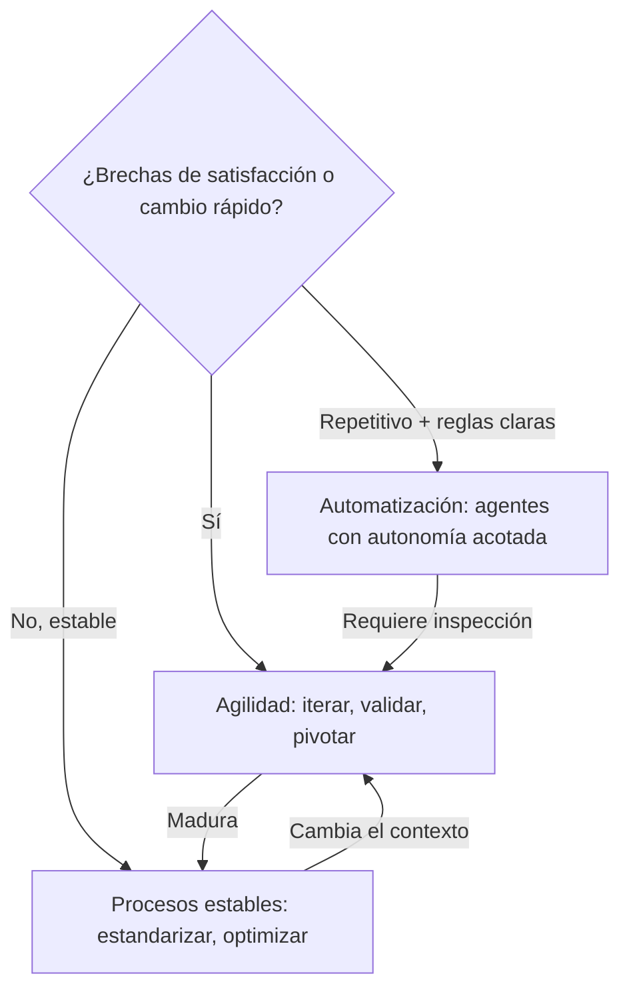
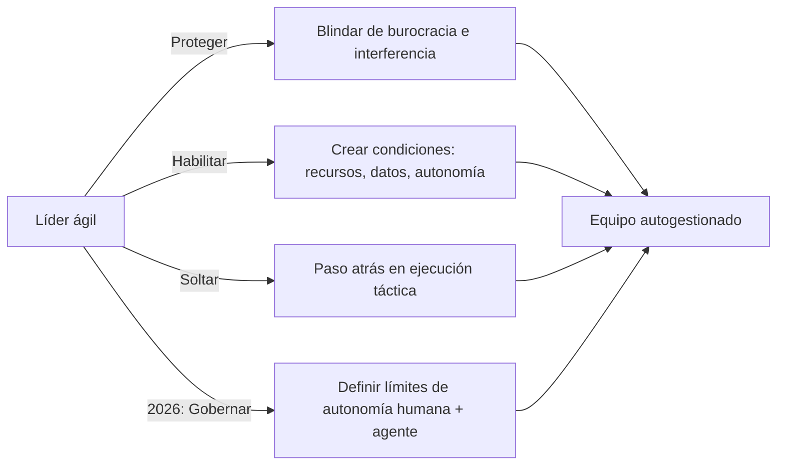
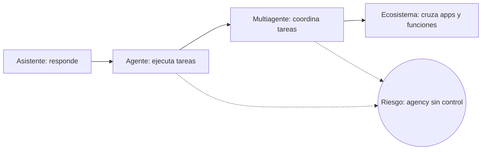
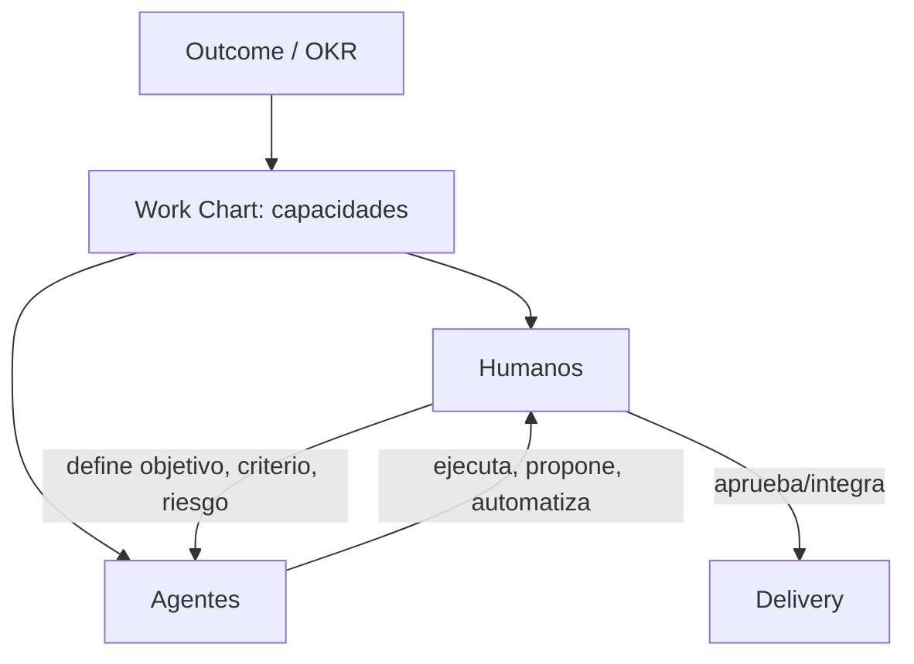
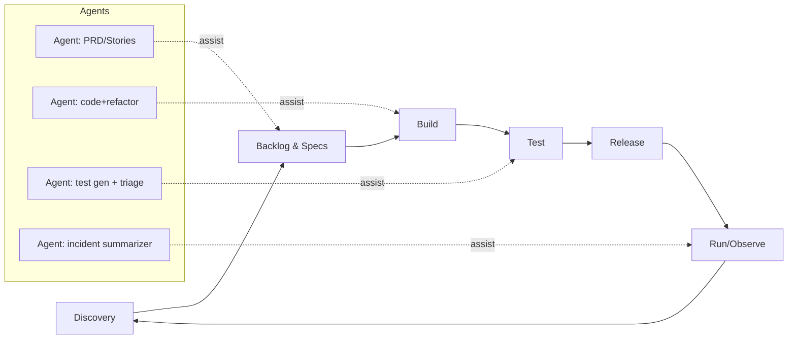

# Gestión de proyectos ágiles en 2026 con IA agentica

## Resumen ejecutivo

La gestión ágil en 2026 ya no compite entre marcos (Scrum vs. Kanban vs. "híbrido"); compite entre **sistemas de entrega** capaces de absorber incertidumbre y **rediseñar** trabajo cuando la ejecución se acelera por IA. Pero esta evolución no invalida los fundamentos: los principios de retroalimentación frecuente, inspección y adaptación siguen siendo la base empírica del agile, y la era agentica los hace más —no menos— críticos. Lo que cambia es el entorno en el que operan, la velocidad a la que se ejecutan los ciclos, y el riesgo de amplificación cuando se pierde transparencia.

La evidencia industrial reciente converge en un punto incómodo: **la IA puede elevar la productividad local, pero eso no garantiza mejoras end‑to‑end**. En el reporte 2024 de DORA (Google Cloud), un aumento del 25% en adopción de IA se asocia con mejoras en calidad de documentación (+7.5%), calidad de código (+3.4%) y velocidad de revisión (+3.1%), pero también con caídas estimadas en throughput de entrega (‑1.5%) y estabilidad (‑7.2%), y con baja confianza (39% reporta poca o ninguna confianza en el código generado por IA). citeturn6view0

En paralelo, la adopción de genAI pasó de "pilotos" a uso regular en muchas organizaciones: 65% reporta uso regular de genAI en 2024 (McKinsey, encuesta global). citeturn21view0 En 2025, McKinsey reporta 71% usando genAI regularmente (en al menos una función), pero **más de 80%** aún no ve impacto tangible en EBIT a nivel enterprise; los casos con impacto exigen rediseño de workflows, liderazgo visible y KPI/ROI explícitos. citeturn18view0

El giro a "era agentica" no es un eslogan: tanto líderes de mercado como analistas reportan que los agentes empiezan a reconfigurar el trabajo. McKinsey (2025) indica que 62% de encuestados ya experimenta con agentes y 23% los está escalando en alguna parte del enterprise, aunque el escalamiento sigue siendo limitado por función. citeturn22view0 En una línea similar, Gartner proyecta que para fines de 2026 el 40% de aplicaciones empresariales tendrá agentes específicos por tarea (vs <5% en 2025). citeturn20view2 En términos organizacionales, Microsoft formaliza el concepto de equipos humano‑agente y el rol "agent boss", señalando que 82% de líderes considera 2025–2026 un punto de inflexión para replantear estrategia y operaciones. citeturn20view0

Esto obliga a reespecificar roles ágiles (Product Owner, Scrum Master, Developers y liderazgo): la unidad de trabajo cambia de "tareas humanas" a "tareas orquestadas humano‑agente", donde el diferencial competitivo está en (1) **diseño del sistema** (gobernanza, plataformas, calidad, seguridad) y (2) **liderazgo** (decisiones de autonomía, responsabilidad y aprendizaje). La base empírica del agile —retroalimentación frecuente, inspección y adaptación— sigue siendo válida, pero ahora se ejecuta en ciclos más cortos y con más riesgo de "amplificación" por IA (errores más rápidos, deuda más rápida). fileciteturn0file0

## Fundamentos ágiles: por qué siguen siendo la base (incluso en era agentica)

Antes de abordar qué cambia con IA agentica, es necesario consolidar los principios que **no** cambian. Las transformaciones ágiles fracasan cuando se tratan como "metodología nueva" en lugar de como un cambio sistémico en cómo se genera valor. Los fundamentos que siguen son condición necesaria —no suficiente— para operar en el contexto 2026.

### El objetivo central de la agilidad

El objetivo principal de la agilidad es ofrecer mejores resultados mediante la obtención de **retroalimentación frecuente**, la **inspección** de los resultados y la **adaptación** en función de esa retroalimentación. Este ciclo empírico (transparencia → inspección → adaptación) no es un ritual: es el mecanismo de control que permite corregir rumbo cuando la incertidumbre es alta. En la era agentica, donde los agentes IA ejecutan tareas a velocidades que superan la capacidad humana de revisión, la necesidad de este ciclo se amplifica: sin inspección frecuente, los errores generados por IA se propagan más rápido y se acumulan como deuda técnica y organizacional. citeturn6view0

### Cuándo la agilidad es esencial —y cuándo no lo es

La agilidad es esencial cuando existen grandes **brechas de satisfacción del cliente** o cuando las **necesidades de los clientes están cambiando rápidamente**. En estos contextos, la capacidad de iterar, validar y pivotar genera ventaja competitiva directa. Sin embargo, cuando las brechas de satisfacción son pequeñas y las necesidades son estables, los **procesos estables** a menudo satisfacen mejor las necesidades de los clientes. Esta distinción es crítica porque muchas organizaciones intentan "agilizar" procesos que funcionan bien con enfoques predecibles, generando fricción sin valor.

En 2026, la IA agentica añade una dimensión a esta decisión: ciertos workflows altamente repetitivos y estables son mejores candidatos para **automatización directa** (agentes con autonomía acotada) que para iteración ágil. La decisión de "ágil vs. estable vs. automatizado" se convierte en un triángulo de diseño organizacional, no en una dicotomía. citeturn20view2turn18view0

### El rol del liderazgo: proteger, habilitar, soltar

Las transformaciones ágiles pueden fracasar porque no cuentan con el **apoyo ejecutivo** o de los **mandos medios**. El liderazgo debe apoyar y proteger a los equipos ágiles de ser arrastrados de vuelta a viejas formas de trabajo, y deben cambiar la dinámica de poder en la organización transfiriendo mecanismos de poder a los equipos ágiles. Esto implica tres movimientos:

1. **Proteger**: blindar a los equipos de interferencia burocrática, deadlines arbitrarios y prioridades contradictorias que erosionan su capacidad de iterar. En la era agentica, "proteger" también significa establecer políticas claras sobre qué pueden y qué no pueden hacer los agentes IA, evitando que presiones de productividad lleven a delegaciones sin control. citeturn18view0

2. **Crear espacio**: diferentes equipos tomarán diferentes caminos hacia los objetivos de su organización. Los líderes ágiles necesitan crear espacio para que todos contribuyan, reconociendo que no existe un "camino único" hacia la entrega de valor. La diversidad de enfoques es una fortaleza, no una amenaza.

3. **Confiar en la inteligencia ascendente**: aprender a confiar en la inteligencia ascendente cambia el papel que los gerentes han desempeñado históricamente en la toma de las "grandes" decisiones y en estar en el centro de toda actividad. Los líderes ágiles desempeñan un papel esencial en la creación de las condiciones en las que los equipos autogestionados empoderados pueden prosperar, pero una vez que esos equipos están listos, los líderes ágiles deben dar un paso atrás y dejar que los equipos alcancen todo su potencial. En el contexto agentico de 2026, este principio se matiza: el líder da paso atrás en la ejecución táctica, pero **intensifica** su rol en gobernanza, definición de límites de autonomía (tanto humana como de agentes) y diseño del sistema de trabajo. citeturn20view0

La evidencia de McKinsey (2025) confirma que el rediseño de workflows y el gobierno ejecutivo visible son los dos factores con mayor correlación con impacto en EBIT atribuible a genAI. Las organizaciones donde el liderazgo "delega sin gobernar" terminan en el grupo del 80%+ que no ve retorno tangible. citeturn18view0

### Equipos: composición dinámica y multifuncionalidad centrada en el usuario

El tamaño de un equipo y los roles que necesita cambiarán a medida que construya su servicio. Se necesitan diferentes habilidades durante las diferentes etapas de desarrollo. Esto es válido tanto en contextos tradicionales como en equipos que integran agentes IA: en fases tempranas de discovery, el equipo puede ser pequeño y exploratorio; en fases de escalamiento, puede requerir especialistas en seguridad, calidad de datos y operaciones de IA que no existían en la fase anterior.

Todo el equipo, y en particular sus diseñadores, investigadores de usuarios, diseñadores de contenido y desarrolladores, deben **trabajar juntos** para diseñar, construir e iterar un servicio basado en las **necesidades de usuario** de las personas a las que va dirigido su servicio. La multifuncionalidad no es un ideal abstracto: es el mecanismo que evita silos de conocimiento y decisiones desconectadas del usuario final. En era agentica, este principio se extiende: los agentes IA deben ser evaluados por su impacto en la experiencia del usuario, no solo por métricas de eficiencia interna. Un agente que "resuelve" tickets 5x más rápido pero degrada la satisfacción del cliente destruye valor. citeturn15view1

### El Delivery Manager: configurar el entorno para que el equipo funcione

El delivery manager (o equivalente: Scrum Master, agile delivery lead) es responsable de liderar la configuración del **entorno ágil** que su equipo necesita para crear e iterar un servicio centrado en el usuario. Esto incluye establecer cadencias de trabajo, eliminar impedimentos, facilitar la colaboración entre disciplinas y asegurar que el equipo tenga acceso a los recursos, datos y herramientas que necesita. En 2026, este rol se expande: el delivery manager también debe asegurar que la integración de herramientas de IA (agentes, copilots, automatizaciones) se haga de manera gobernada, evaluada y alineada con los principios de calidad y transparencia del equipo. citeturn17view1turn17view2

### Síntesis: los fundamentos como pre-requisito para la era agentica

Estos principios no son "básicos" en el sentido de triviales; son **pre-requisitos estructurales**. Una organización que no tiene liderazgo protector, equipos multifuncionales autogestionados, ciclos de retroalimentación frecuente y un delivery manager habilitador no puede adoptar IA agentica de forma efectiva — solo puede adoptar herramientas de IA de forma caótica. La era agentica amplifica tanto las virtudes como los defectos del sistema organizacional: si los fundamentos son sólidos, la IA potencia el valor; si son frágiles, la IA acelera la disfunción.

---

## Diseño de la sesión

**Audiencia objetivo**: profesionales de TI y gerencia intermedia (líderes de equipos, PM/TPM, PO/PM, SM/Agile Coach, líderes de ingeniería, arquitectura, QA, seguridad).

**Resultados de aprendizaje (lo que la audiencia debe poder hacer al final)**  
1) Validar los fundamentos ágiles (empirismo, liderazgo habilitador, equipos multifuncionales centrados en usuario, delivery management) como pre-requisitos para operar en la era agentica. fileciteturn0file0  
2) Diagnosticar qué parte del desempeño ágil es "local" vs "sistémica" (y por qué IA suele mejorar lo primero y castigar lo segundo si no hay rediseño). citeturn6view0turn16view1  
3) Redefinir roles y liderazgo en equipos humano‑agente con criterios de autonomía, control y responsabilidad (human‑agent ratio, "agent boss", límites de delegación). citeturn20view0  
4) Adoptar una gobernanza pragmática (capas, guardrails, métricas) alineada a cumplimiento y seguridad (EU AI Act, NIST, OWASP) sin frenar delivery. citeturn19view0turn23view0turn3search3  
5) Implementar un set mínimo de métricas (DORA + flujo + calidad + ROI + riesgo) que conecte productividad individual con outcomes de producto y estabilidad operacional. citeturn6view0turn16view2turn18view0

## Estructura detallada con tiempos

**Duración total**: 90 minutos

| Bloque | Objetivo | Tiempo |
|---|---:|---:|
| Apertura y contrato | Alinear expectativas: "agile como sistema socio‑técnico en era agentica" | 5 min |
| Fundamentos ágiles: la base que no cambia | Empirismo, liderazgo protector, equipos multifuncionales, delivery management, cuándo sí/cuándo no usar agilidad | 10 min |
| Realidad 2026: adopción y evidencia | Datos duros: adopción, productividad, calidad, ROI (incluyendo resultados contradictorios) | 15 min |
| Qué cambia en el trabajo | De "equipo ágil" a "equipo humano‑agente": loops, autonomía, y efecto en flujo/estabilidad | 15 min |
| Roles y liderazgo redefinidos | PO/SM/Devs/Líderes + delivery manager + nuevos roles IA; competencias; decisiones que hoy sí importan | 20 min |
| Gobernanza y operating model | Modelos (central/federado/product‑aligned), guardrails, métricas y cadencias | 15 min |
| Casos breves + ejercicio | 3–5 casos cuantificados + mini‑taller de rediseño (human‑agent ratio y límites) | 8 min |
| Cierre | Riesgos, checklist de implementación y lecturas | 2 min |

## Diapositivas sugeridas y material visual listo para usar

A continuación se propone un deck de ~28 diapositivas. Cada diapositiva incluye: título, puntos clave, notas y un visual listo para pegar (mermaid/tablas) o una guía de gráfico.

**Convención para el presentador**: En notas incluyo "Pregunta al grupo" cuando conviene generar interacción y elevar la sesión de exposición a entrenamiento.

### Slide 1 — Contexto y promesa de la sesión
**Puntos clave**
- Ágil en 2026 = optimización de sistema de entrega, no "rituales".
- IA agentica acelera ejecución y amplifica errores; el liderazgo se vuelve el cuello de botella.
- Primero afianzamos fundamentos; luego los proyectamos al nuevo contexto.

**Notas del presentador**
- Enmarcar: "si todo se vuelve más rápido, el costo de una mala decisión también".
- Conectar con evidencia DORA: productividad local vs performance de entrega. citeturn6view0
- Anticipar: "vamos a revisar qué sigue siendo cierto y qué necesita actualizarse".

**Visual sugerido (mini‑gráfico)**
- Línea "productividad individual" vs "throughput/estabilidad" con signos opuestos (basado en DORA 2024). citeturn6view0turn16view1

### Slide 2 — El objetivo central de la agilidad (fundamento 1)
**Puntos clave**
- El objetivo principal de la agilidad: mejores resultados mediante retroalimentación frecuente, inspección y adaptación.
- Empirismo: transparencia → inspección → adaptación.
- Si se pierde transparencia, la inspección se vuelve engañosa y costosa.
- Este ciclo es más necesario —no menos— cuando la IA acelera la ejecución.

**Notas del presentador**
- Pregunta al grupo: "¿Cuántos de sus equipos tienen cadencias reales de inspección que incluyan la calidad del output generado por IA?"
- Aterrizar con la Guía de Scrum (versión español LatAm). citeturn16view5turn17view0
- Conectar con DORA: los equipos que mejoran calidad de documentación/código (+7.5%/+3.4%) son los que revisan; los que pierden estabilidad (−7.2%) son los que no. citeturn6view0

### Slide 3 — Cuándo la agilidad es esencial y cuándo no (fundamento 2)
**Puntos clave**
- La agilidad es esencial cuando: grandes brechas de satisfacción del cliente O necesidades cambiando rápidamente.
- Cuando las brechas son pequeñas y las necesidades estables: procesos estables satisfacen mejor.
- En 2026 se agrega una tercera opción: automatización directa para workflows repetitivos y estables.
- Decisión de diseño = triángulo: ágil vs. estable vs. automatizado.

**Notas del presentador**
- Pregunta al grupo: "Piensen en un proceso de su organización: ¿es candidato a iteración ágil, a estabilización, o a automatización con agentes?"
- Conectar con Gartner: la distinción assistant vs agent vs multiagente implica diferentes niveles de estabilidad del workflow. citeturn20view2

**Visual (mermaid)**

### Slide 4 — Liderazgo ágil: proteger, habilitar, soltar (fundamento 3)
**Puntos clave**
- Las transformaciones ágiles fracasan sin apoyo ejecutivo ni de mandos medios.
- El liderazgo debe proteger a los equipos de ser arrastrados a viejas formas de trabajo.
- Debe transferir mecanismos de poder a los equipos ágiles (cambiar la dinámica de poder).
- Confiar en la inteligencia ascendente: los líderes crean condiciones, luego dan paso atrás.
- En era agentica: el líder se retira de la ejecución táctica pero intensifica su rol en gobernanza, límites de autonomía y diseño del sistema.

**Notas del presentador**
- Dato clave: McKinsey (2025) muestra que >80% de organizaciones sin gobierno ejecutivo visible no logra retorno tangible de genAI. citeturn18view0
- Pregunta al grupo: "¿Qué porcentaje del tiempo de su liderazgo se invierte en proteger al equipo vs. en pedir reportes de status?"
- Enfatizar: diferentes equipos tomarán diferentes caminos hacia los objetivos. Los líderes necesitan crear espacio para que todos contribuyan, no uniformar.

**Visual (mermaid)**

### Slide 5 — Equipos multifuncionales centrados en usuario (fundamento 4)
**Puntos clave**
- El equipo completo (diseñadores, investigadores de usuarios, desarrolladores, contenido) debe trabajar junto para diseñar, construir e iterar un servicio basado en necesidades de usuario.
- La multifuncionalidad evita silos y decisiones desconectadas del usuario final.
- El tamaño del equipo y los roles cambian según la etapa de desarrollo.
- En era agentica: los agentes se evalúan por impacto en usuario, no solo por eficiencia interna.

**Notas del presentador**
- Caso Klarna como ejemplo dual: alta eficiencia (2.3M conversaciones, −25% repetición), pero el valor real está en resolución <2 min vs 11, que es una métrica de experiencia de usuario. citeturn15view1
- Pregunta al grupo: "¿Cómo miden hoy si sus herramientas IA mejoran o empeoran la experiencia del usuario final?"

### Slide 6 — El Delivery Manager: configurar el entorno (fundamento 5)
**Puntos clave**
- El delivery manager (SM, agile delivery lead) lidera la configuración del entorno ágil que el equipo necesita.
- Responsabilidades: cadencias de trabajo, eliminación de impedimentos, facilitación de colaboración entre disciplinas, acceso a recursos.
- En 2026: también asegura que la integración de IA sea gobernada, evaluada y alineada con calidad y transparencia.
- El delivery manager conecta los fundamentos (empirismo, multifuncionalidad, liderazgo protector) con la operación diaria.

**Notas del presentador**
- Anclar en Scrum Guide: el Scrum Master establece Scrum y logra efectividad del equipo como líder servidor. citeturn17view1turn17view2
- Conexión directa: si el delivery manager no configura prácticas de revisión de outputs IA, la "inspección" del Slide 2 no ocurre.
- Pregunta al grupo: "¿Quién en su equipo tiene la responsabilidad explícita de configurar cómo se integra IA al flujo de trabajo?"

### Slide 7 — Qué entenderemos por era agentica
**Puntos clave**
- Agentes = sistemas que planifican y ejecutan múltiples pasos (no solo chat).
- El problema real: **agencia excesiva + bajo control**.

**Notas**
- Usar Gartner: transición de assistants a task‑specific agents; riesgo de "agentwashing". citeturn20view2

**Visual (mermaid)**

("Stages" inspirados en la evolución descrita en Gartner). citeturn20view2

### Slide 8 — Scrum roles: lo "canónico" como punto de partida
**Puntos clave**
- Scrum Team: Product Owner, Scrum Master, Developers.
- Equipo autónomo, multifuncional, con foco en Objetivo del Producto.
- Scrum Master como líder servidor: establece Scrum, logra efectividad, sirve al equipo y a la organización.

**Notas**
- Importante: en era agentica no se elimina la accountability; se reubica. citeturn17view0turn17view1

### Slide 9 — Adopción de IA: la curva ya cruzó el umbral
**Puntos clave**
- 65% de organizaciones reporta uso regular de genAI (2024).
- 71% reporta uso regular de genAI (2025) y 78% usa AI en al menos una función (2024, encuesta 2025).
- 62% experimenta con agentes (2025) y 23% los escala en alguna función.

**Notas**
- Subrayar: uso ≠ valor enterprise (la trampa de "tool rollout"). citeturn21view0turn18view0turn22view0

**Visual (datos para gráfico de líneas)**
- Serie A: "Uso regular genAI" (2024: 65; 2025: 71). citeturn21view0turn18view0  
- Serie B: "Experimenta con agentes" (2025: 62). citeturn22view0  
Recomendación: gráfico de líneas (año vs %).

### Slide 10 — Productividad: lo que sube (y lo que no)
**Puntos clave**
- IA eleva productividad en tareas cognitivas medianamente estructuradas:
  - Escritura profesional: tiempo −40%, calidad +18%. citeturn0search1
  - Contact center: +14% productividad promedio; +34% en novatos. citeturn0search2
  - Tarea de programación (laboratorio): +55.8% más rápido con Copilot. citeturn0search0

**Notas**
- Enfatizar heterogeneidad: mayor ganancia en perfiles menos expertos. citeturn0search0turn0search2

### Slide 11 — Advertencia: estudios donde IA hace más lento al experto
**Puntos clave**
- RCT en devs open‑source expertos (2025): con IA tardan 19% más. citeturn13search0turn13search4
- Brecha percepción‑realidad: creen ser más rápidos aun siendo más lentos. citeturn13search4

**Notas**
- Mensaje de liderazgo: "adopción selectiva + medición real + entrenamiento", no fe.  

### Slide 12 — Evidencia DORA: mejoras locales vs pérdidas sistémicas
**Puntos clave**
- +25% adopción IA asociado a:
  - +7.5% calidad documentación
  - +3.4% calidad código
  - +3.1% velocidad code review  
  …pero también −1.5% throughput y −7.2% estabilidad. citeturn6view0
- A nivel individual: adopción +25% se asocia con +2.6% flow, +2.2% satisfacción laboral, +2.1% productividad (estimado). citeturn16view1

**Notas**
- Aquí está el "porqué" del curso: la gestión ágil debe **convertir mejoras locales en outcomes**.
- Conexión con fundamentos: sin el ciclo inspección → adaptación (Slide 2), estas mejoras locales nunca se convierten en mejoras sistémicas.

**Visual (pegar imagen o recrear)**
- Recomiendo incrustar la figura tipo forest plot (flow/satisfacción/productividad) del reporte DORA genAI. citeturn16view1

### Slide 13 — El "vacuum effect": el tiempo liberado no se vuelve valor por sí solo
**Puntos clave**
- Si IA acelera tareas valiosas, se crea "vacío de tiempo".
- Si la organización no rediseña, ese vacío se rellena con más burocracia/retrabajo.

**Notas**
- Conectar con hallazgo DORA: tiempo en trabajo valioso cae (estimado −2.6%) aun subiendo flow/productividad. citeturn16view1
- Conexión con fundamentos: el rol del liderazgo (Slide 4) es proteger ese "vacío" para que se convierta en innovación o mejora, no en burocracia.

### Slide 14 — El cambio estructural clave: de org chart a work chart
**Puntos clave**
- Estructuras más fluidas, orientadas a resultados, ensamblando humanos y agentes.
- Nuevo KPI: "human‑agent ratio" (cuántos agentes por rol/tarea y cuántos humanos para guiarlos). citeturn20view0

**Notas**
- Reforzar: no es reducción de headcount como fin; es rediseño de capacidad. citeturn20view0turn22view0
- Conexión con fundamento: "el tamaño del equipo y los roles cambian según la etapa de desarrollo" — en 2026 esto es dinámico a nivel de sprint, no solo de fase de proyecto.

**Visual (mermaid)**

(Concepto de work charts y human‑agent ratio basado en Work Trend Index 2025). citeturn20view0

### Slide 15 — Qué trabajo pasa "a agentes" primero
**Puntos clave**
- IA genera mayor valor cuando reduce búsqueda/alternativas y trabajo repetitivo:
  - Resumen, explicación, drafts, generación de tests, refactors, documentación. citeturn6view0turn15view0
- En proyectos/PM: motivación dominante es eficiencia/gestión del tiempo (84%); 56% reporta ahorrar ≥5h/semana. citeturn16view3

**Notas**
- Hacer el puente a roles: PO/SM ganan más en escritura, síntesis y comunicación; Devs en "scaffolding" y boilerplate, pero con riesgo de deuda.

### Slide 16 — Mapa del sistema ágil‑agentico
**Puntos clave**
- Agentes aceleran: ideación → especificación → entrega → observabilidad.
- El control se desplaza a: reglas, pruebas, políticas y revisión.

**Visual (mermaid: sistema end‑to‑end)**

### Slide 17 — Evolución de roles: de "hacer" a "orquestar y asegurar"
**Puntos clave**
- Roles Scrum permanecen; cambia el contenido:
  - PO: diseño de valor + decisiones sobre automatización y riesgos.
  - SM/Delivery Manager: arquitectura social + adopción + guardrails de IA + configuración del entorno.
  - Devs: diseño, integración, evaluación, pruebas, seguridad (más que teclear).
- El delivery manager sigue siendo responsable de configurar el entorno que el equipo necesita para iterar; ahora ese entorno incluye agentes.

**Notas**
- Anclar en definiciones oficiales (Scrum Guide). citeturn17view1turn17view2
- Conexión con fundamentos: la accountability no desaparece, se reubica y se expande.

### Slide 18 — Tabla comparativa: roles clásicos vs era agentica
**Tabla lista para usar**

| Rol | Accountability base (Scrum Guide) | "Upgrade" 2026 por IA agentica | Artefactos nuevos que el rol debe dominar |
|---|---|---|---|
| Product Owner | Maximizar valor; gestionar Product Backlog citeturn17view1 | Diseñar "value + guardrails": decidir qué se delega a agentes, con qué límites; priorizar rediseño de workflow para capturar EBIT (no solo tool usage) citeturn18view0 | *Policy‑by‑design*, criterios de aceptación verificables, *eval sets* mínimos |
| Scrum Master / Delivery Manager | Establecer Scrum; lograr efectividad; liderazgo servidor; configurar entorno ágil citeturn17view1turn17view2 | "Flow & adoption architect": entrenar uso/validación, bajar fricción, proteger foco; construir confianza medible (p. ej. code review, pruebas, telemetría); asegurar integración gobernada de IA citeturn6view0turn15view0 | Guías de uso, checklists de validación, métricas DevEx/Flow citeturn16view1 |
| Developers | Entregar Increment; plan del Sprint; calidad en DoD citeturn17view0 | "Engineer + evaluator": orquestar agentes, revisar, asegurar seguridad, testear; gestionar deuda y contaminación de código citeturn6view0turn15view0 | Suites de pruebas, linters/SSAST, revisión de prompts/instrucciones |
| Líderes (Eng/IT/Producto) | Crear condiciones para equipos efectivos; proteger de viejas formas de trabajo; transferir poder a equipos | "Agent‑boss / system steward": definir human‑agent ratio, rediseñar estructura (work charts), decidir centralización vs federación; confiar en inteligencia ascendente sin abdicar gobernanza citeturn20view0turn18view0 | Modelo de gobernanza, métricas de impacto (EBIT/ROI), controles de riesgo citeturn18view0turn23view0 |

### Slide 19 — Nuevos roles IA (y por qué surgen)
**Puntos clave**
- Surgen por 3 tensiones: seguridad, cumplimiento, medición/ROI.
- Roles emergentes reportados/anticipados: AI Security Specialist, AI Agent Specialist, AI ROI Analyst, Chief AI Officer (entre otros). citeturn20view1
- Estos roles necesitan diferentes habilidades según la etapa de desarrollo de la capacidad IA de la organización.

**Notas**
- Enfatizar: no "inflar headcount", sino clarificar ownership de decisiones de alto riesgo.

### Slide 20 — Modelo de colaboración humano‑agente por nivel de autonomía
**Tabla lista para usar**

| Nivel | Qué hace el agente | Qué hace el humano | Cuándo usar | Riesgo dominante |
|---|---|---|---|---|
| Asistencia | Sugiere, resume, genera borradores | Decide y ejecuta | Trabajo con alta ambigüedad o alto riesgo | Sobreconfianza / alucinación citeturn22view0 |
| Delegación con revisión | Ejecuta subtareas; produce PRs, casos de prueba | Revisa y aprueba | Tareas repetitivas, specs claros | Deuda por throughput citeturn6view0 |
| Autonomía acotada (agentic) | Orquesta pasos dentro de límites | Define límites, monitorea, audita | Workflows maduros y observables | Agency excesiva / fuga de datos citeturn3search3turn20view2 |
| Autonomía alta (rara en 2026) | Toma decisiones y ejecuta end‑to‑end | Supervisión post‑hoc | Solo en dominios muy controlados | Cumplimiento y responsabilidad |

### Slide 21 — Liderazgo: lo que sí debe centralizarse
**Puntos clave**
- No centralices "uso de herramientas"; centraliza:
  - Políticas (datos, IP, seguridad, privacidad).
  - Evaluación y métricas.
  - Gestión de incidentes/errores con IA.
- McKinsey muestra que rediseño de workflows y gobierno ejecutivo se correlacionan con EBIT reportado. citeturn18view0
- Esto no contradice la inteligencia ascendente: los equipos ejecutan y deciden dentro de límites; el liderazgo diseña los límites y protege el espacio.

### Slide 22 — Gobernanza: 3 modelos operativos que funcionan (y sus trade‑offs)
**Tabla lista para usar**

| Modelo | Cómo se organiza | Ventajas | Riesgos | Cuándo encaja |
|---|---|---|---|---|
| Centralizado (AI CoE fuerte) | Decisiones IA en un centro | Consistencia, control, cumplimiento | Cuellos de botella, baja adopción local | Industrias reguladas, riesgo alto |
| Federado | Centro define guardrails; unidades ejecutan | Balance entre velocidad y control | Inconsistencia, "shadow AI" | Empresas multi‑unidad que ya operan por productos |
| Product‑aligned (por value streams) | Governance integrada al flujo de producto | Conecta IA con outcomes; mejor feedback loop | Requiere madurez de medición | Cuando agile ya está escalado y hay telemetría |

**Notas**
- Conectar con McKinsey: solo 18% reportaba un council/board con autoridad para IA responsable (early 2024). citeturn21view0  
- Esto se vuelve un gap crítico en 2026.

### Slide 23 — Métricas: tablero mínimo viable para evitar "local wins / system losses"
**Puntos clave**
- Mantener DORA + métricas de calidad + ROI + riesgo + DevEx.
- Medir "impacto neto": productividad – retrabajo – incidentes – drift de calidad.

**Visual (tabla de métricas lista para usar)**

| Dimensión | Métrica | Por qué importa | Señal de alerta |
|---|---|---|---|
| Velocidad end‑to‑end | Lead time / throughput (DORA) | Captura el sistema completo | Throughput baja aun con "más commits" citeturn6view0 |
| Estabilidad | Change failure rate / estabilidad | Señala deuda y fragilidad | Estabilidad cae con IA citeturn6view0 |
| Calidad | Build success, PR merge rate, defect escape | IA puede inflar volumen con deuda | Aumenta volumen; cae merge rate citeturn15view0 |
| Productividad individual | Flow / productividad percibida | Indicador humano (sostenibilidad) | Suben percepciones, baja valor real citeturn16view1turn13search4 |
| ROI | % EBIT atribuible; costo/beneficio por caso | Evita "AI theater" | >80% sin impacto EBIT enterprise aún citeturn18view0 |
| Riesgo | Incidentes IA (privacidad, IP, sesgo) | Cumplimiento y reputación | Consecuencias por inexactitud citeturn21view0turn22view0 |

### Slide 24 — Ejercicio guiado: define tu human‑agent ratio y límites
**Instrucción**
- Elige un flujo (ej.: sprint planning, PR review, incident response).
- Define:
  1) qué sub‑tareas delegas a agente,
  2) qué evidencia exige el humano para aprobar,
  3) qué métrica de "impacto neto" monitoreas 4 semanas.

**Notas**
- Enfatizar que sin rediseño de workflow, el tiempo ahorrado no se convierte en valor. citeturn18view0turn16view1

### Slide 25 — Caso breve: Copilot en enterprise (evidencia cuantificada)
**Puntos clave**
- RCT en Accenture: +8.69% PRs; +15% PR merge rate; +84% successful builds; ~30% aceptación de sugerencias; mejoras fuertes en satisfacción (90% más "fulfilled"; 95% disfruta más). citeturn15view0  
- Interpretación: sube throughput local **y** señales de calidad (merge/build), pero requiere telemetría y prácticas de revisión.

**Notas**
- Pregunta al grupo: ¿qué parte de su pipeline hoy capturaría "successful builds" y "merge rate" como calidad?

### Slide 26 — Caso breve: Klarna y atención al cliente (agentic value)
**Puntos clave**
- Asistente IA: 2.3M conversaciones (≈2/3 chats); equivalente a 700 FTE; −25% repetición; resolución <2 min vs 11; estimación de +$40M mejora de beneficios 2024; 90% de empleados usa herramientas genAI diariamente. citeturn15view1  
- Revenue por empleado +73% (SEK 4M→7M) y reducción de headcount vía attrition con apoyo de chatbots. citeturn14news40

**Notas**
- Pivote a delivery: agentes sí pueden "comerse" procesos completos si hay datos, límites y medición.  
- Advertir: este tipo de claims suelen ser "best case" y deben auditarse internamente.
- Conexión con fundamentos: la multifuncionalidad y el enfoque centrado en usuario (Slide 5) son lo que permite evaluar si este caso genera valor real o solo eficiencia aparente.

### Slide 27 — Caso breve: productividad en escritura y servicio (transferible a PO/SM)
**Puntos clave**
- Escritura profesional: −40% tiempo, +18% calidad con ChatGPT. citeturn0search1  
- Contact center: +14% productividad promedio; +34% para novatos. citeturn0search2

**Notas**
- Transferencia directa:
  - PO: PRDs, historias, criterios.
  - SM/PM: comunicaciones, minutas, riesgos.
  - Leadership: síntesis ejecutiva y decisiones.

### Slide 28 — Cierre: checklist de implementación (30 días)
**Puntos clave**
- Verificar fundamentos: ¿hay liderazgo protector, equipos multifuncionales, cadencias de inspección reales?
- Medir antes/después (DORA + DevEx + calidad).
- Definir guardrails (datos/IP/seguridad) + entrenamiento.
- Empezar por 1–2 workflows, no por "comprar todo".

**Notas**
- Conectar con PMI Sweden: 64% recomienda iniciar pequeño y escalar gradualmente; preocupación dominante privacidad/seguridad (72%). citeturn16view3  
- Cerrar con compliance 2025–2027 EU AI Act. citeturn19view0
- Mensaje final: "La IA agentica amplifica lo que ya tienen. Si los fundamentos son sólidos, amplifica valor. Si son frágiles, amplifica disfunción."

## Métricas y data dura verificable

Esta sección consolida métricas exigidas (productividad, velocidad, calidad, ROI, adopción, automatización) en un formato directamente reutilizable para tu presentación.

### Adopción y escalamiento de IA

| Indicador | Valor | Fuente primaria |
|---|---:|---|
| Organizaciones con uso regular de genAI (2024) | 65% | McKinsey, encuesta early 2024 citeturn21view0 |
| Organizaciones con uso de AI en ≥1 función (2024, encuesta 2025) | 78% | McKinsey, encuesta Mar 2025 citeturn18view0 |
| Organizaciones con uso regular de genAI (2024, encuesta 2025) | 71% | McKinsey, encuesta Mar 2025 citeturn18view0 |
| Uso de AI en ≥1 función (2025) | 88% | McKinsey, encuesta Nov 2025 citeturn22view0 |
| Organizaciones experimentando con agentes (2025) | 62% (39% experimenta + 23% escala en alguna parte) | McKinsey, encuesta Nov 2025 citeturn22view0 |
| Apps enterprise con agentes específicos por tarea (proyección 2026) | 40% | Gartner press release (2025) citeturn20view2 |
| Devs usando AI en su proceso (2024) | 62% usa actualmente; 76% usa o planea usar | Stack Overflow Developer Survey 2024 citeturn2search0 |

### Productividad, velocidad y calidad

| Contexto | Métrica | Efecto cuantificado | Fuente primaria |
|---|---|---:|---|
| Escritura profesional | Tiempo de tarea | −40% | Science (Noy & Zhang, 2023) citeturn0search1 |
| Escritura profesional | Calidad | +18% | Science (Noy & Zhang, 2023) citeturn0search1 |
| Contact center | Issues/hora | +14% promedio; +34% novatos | NBER working paper (Brynjolfsson et al., 2023) citeturn0search2 |
| Programación (lab) | Tiempo de tarea | +55.8% más rápido | arXiv (Peng et al., 2023) citeturn0search0 |
| Dev enterprise (RCT) | Pull requests | +8.69% | GitHub Blog + Accenture citeturn15view0 |
| Dev enterprise (RCT) | Merge rate | +15% | GitHub Blog + Accenture citeturn15view0 |
| Dev enterprise (RCT) | Successful builds | +84% | GitHub Blog + Accenture citeturn15view0 |
| Dev productivity (RCT, expertos) | Tiempo de tarea | +19% (más lento) | METR RCT 2025 citeturn13search0turn13search4 |
| DORA 2024 (sistémico) | Doc/code/review quality | +7.5% doc; +3.4% code; +3.1% review speed (por +25% adopción IA) | Google Cloud Blog DORA 2024 citeturn6view0 |
| DORA 2024 (sistémico) | Throughput/estabilidad entrega | −1.5% throughput; −7.2% estabilidad (por +25% adopción IA) | Google Cloud Blog DORA 2024 citeturn6view0 |
| DORA genAI (individual) | Flow/satisfacción/productividad | +2.6% flow; +2.2% satisfacción; +2.1% productividad (por +25% adopción IA) | Reporte DORA genAI citeturn16view1 |

### ROI, automatización y "value capture"

| Indicador | Valor | Fuente primaria |
|---|---:|---|
| Potencial económico anual genAI (63 casos) | USD $2.6T–$4.4T | McKinsey (2023) citeturn11view0 |
| Actividades potencialmente automatizables (tiempo de empleados) | 60–70% | McKinsey (2023) citeturn11view0 |
| Impacto a nivel EBIT enterprise (genAI, 2025 survey) | >80% sin impacto tangible; 17% reporta ≥5% EBIT atribuible | McKinsey (2025) citeturn18view0 |
| Rediseño de workflows (condición de impacto) | 21% reporta rediseño fundamental de al menos algunos workflows | McKinsey (2025) citeturn18view0 |
| Caso Klarna (beneficio estimado) | +$40M profit improvement en 2024 | OpenAI case study citeturn15view1 |

**Nota metodológica (para decir en la sesión)**: Los efectos de productividad varían fuertemente por (a) especificidad de la tarea, (b) experiencia del profesional, (c) madurez del repositorio/proceso, (d) controles de calidad y (e) calidad del dato/contexto. Esto explica por qué coexisten resultados "+55% más rápido" (lab) y "+19% más lento" (experto en repo propio). citeturn0search0turn13search4

## Cambios en roles, gobernanza y colaboración humano‑agente

### Cambios estructurales que debes enseñar (no opcionales)

1) **De proyectos a productos/valor**: la IA premia organizaciones que pueden rediseñar workflows y operar con telemetría; en McKinsey, el rediseño de workflows aparece como el atributo con mayor efecto en lograr EBIT reportado por genAI. citeturn18view0  
2) **De "gestionar tareas" a "gestionar autonomía"**: con agentes, el control efectivo no está en asignar tickets sino en definir límites, evidencia requerida y responsabilidad. Gartner explícitamente distingue assistants vs agents y alerta sobre el error conceptual ("agentwashing"). citeturn20view2  
3) **De roles estables a capacidades ensamblables**: Microsoft describe transición a work charts y necesidad de human‑agent ratio. citeturn20view0  

### Recomendaciones concretas de gobernanza (operables en 90 días)

**Gobernanza mínima viable (GMV) para IA en equipos ágiles**  
- **Política de datos e IP**: qué puede entrar a modelos/servicios; qué debe anonimizarse; qué queda prohibido. (Razón: privacidad/seguridad es la principal preocupación en PM; 72% en encuesta PMI Sweden). citeturn16view3  
- **Guardrails técnicos**: pruebas automatizadas, revisión humana obligatoria para cambios de alto impacto, y controles contra riesgos típicos de LLM (prompt injection, fuga de datos, supply chain). citeturn3search3turn15view0  
- **Sistema de medición**: DORA + calidad + ROI + riesgo; con cadencia de revisión mensual para evitar "local wins / system losses". citeturn6view0turn16view2turn18view0  
- **RACI de responsabilidad**: quién es accountable si el agente introduce regresiones, fuga de datos o incumplimiento; sin esto, la "autonomía" se vuelve riesgo sistémico.

### Competencias críticas por rol (lo que entrenas, no lo que "explicas")

| Rol | Competencias 2026 imprescindibles | Cómo se evidencia (observable) |
|---|---|---|
| PO/PM | Diseño de experimentos de valor, priorización por ROI/riesgo, rediseño de workflow | Backlog con criterios verificables + métricas de outcome citeturn18view0 |
| SM/Delivery Manager | Facilitación de adopción, diseño de cadencias de feedback, reducción de fricción y de "toil", configuración del entorno ágil para integración de IA | Mejora sostenida en flow/DevEx + estabilidad citeturn16view1turn6view0 |
| Dev/QA | Evaluación, pruebas, seguridad, revisión de outputs IA | Merge/build success + defect escape controlado citeturn15view0 |
| Líderes | Diseño de operating model, human‑agent ratio, gobierno ejecutivo, protección de equipos, transferencia de poder | Políticas + KPIs + decisiones claras de autonomía + evidencia de apoyo a equipos citeturn20view0turn18view0 |

## Casos de uso y estudios de caso breves con resultados cuantificados

### Programación y delivery en enterprise

**Caso**: Copilot en Accenture (RCT + telemetría)  
**Resultados**: +8.69% pull requests; +15% merge rate; +84% successful builds; 30% aceptación de sugerencias; altos indicadores de satisfacción (90% más satisfechos; 95% disfruta más). citeturn15view0  
**Lectura estratégica**: cuando hay telemetría y prácticas de calidad, el "aumento de output" puede acompañarse de señales de calidad; sin esos controles, el riesgo es "deuda acelerada" (coherente con DORA 2024). citeturn6view0

### Productividad en tareas cognitivas (transferible a PO/SM)

**Caso**: Escritura profesional (experimento controlado)  
**Resultados**: −40% tiempo, +18% calidad. citeturn0search1  
**Aplicación ágil típica**: PRDs, historias, criterios de aceptación, comunicaciones de stakeholders, minutas y síntesis para comités.

### Operaciones y servicio con aumento de capacidad

**Caso**: GenAI en contact center (Fortune 500, estudio longitudinal)  
**Resultados**: +14% productividad promedio (+34% en novatos); evidencia de aprendizaje/transferencia de mejores prácticas. citeturn0search2  
**Aplicación ágil típica**: L2/L3 support, triage de incidentes, base de conocimiento, runbooks — con supervisión humana.

### Agente "end‑to‑end" en servicio al cliente

**Caso**: Klarna (asistente IA + despliegue organizacional)  
**Resultados**: 2.3M conversaciones en 1 mes (≈2/3 de chats), equivalente a 700 FTE; −25% repetición; resolución <2 min vs 11; +$40M profit improvement estimado (2024); 90% empleados usa herramientas genAI diariamente. citeturn15view1  
**Caveat de rigor**: métricas de "equivalente FTE" dependen de supuestos internos (tiempo estándar por interacción, mix de casos). Para replicar, exige método de cálculo interno.

### Contracaso (para liderazgo y gestión del cambio)

**Caso**: METR RCT en devs expertos open‑source  
**Resultados**: con IA tardan +19% (más lento) pese a creer que mejoran ~20%. citeturn13search4turn13search0  
**Lectura estratégica**: si el trabajo es altamente contextual, con repos grandes y estándares altos, el costo de "verificar/corregir" puede dominar. Enseñanza clave: **no medir = autoengaño**.

## Riesgos, consideraciones éticas y de cumplimiento

### Riesgos operativos que más destruyen valor en agilidad con IA

1) **Erosión de estabilidad por throughput artificial**: DORA 2024 muestra degradación estimada de throughput y estabilidad con mayor adopción de IA, aun con mejoras locales. citeturn6view0  
2) **Sobreconfianza / baja confianza simultánea**: baja confianza en outputs (39% poco o nada de confianza) puede generar más revisión y fricción; si se ignora, aumenta riesgo de defectos. citeturn6view0turn15view0  
3) **Agency excesiva**: riesgos específicos de apps LLM incluyen prompt injection, fuga de información sensible, supply chain, y "excessive agency". citeturn3search3turn3search15  
4) **Compliance y responsabilidad difusa**: agentes cruzan funciones y apps; por eso Gartner destaca necesidad de estrategia agentica e interoperabilidad, y alerta sobre proyectos cancelados por costos/resultados inciertos. citeturn20view2turn1news40  

### Cumplimiento (mínimo que debes mencionar en la sesión)

- **EU AI Act (Regulación 2024/1689)**: en vigor desde 1‑Ago‑2024; prohibiciones y alfabetización IA aplican desde 2‑Feb‑2025; obligaciones para GPAI aplican desde 2‑Ago‑2025; obligaciones principales aplican desde 2‑Ago‑2026; high‑risk embebido en productos regulados con transición hasta 2‑Ago‑2027. citeturn19view0  
- **Marco de riesgo**: NIST publica AI RMF 1.0 (enfoque sistemático de riesgos de IA). citeturn23view0turn3search5  
- **Seguridad aplicada**: OWASP Top 10 para aplicaciones LLM provee taxonomía práctica de amenazas (prompt injection, data poisoning, etc.). citeturn3search3turn3search7

### Ética (pragmática, no discursiva)

- **Sesgo y equidad**: en encuesta PMI Sweden, 56% reporta preocupación por sesgo/fairness, pero privacidad/seguridad domina (72%). Esto sugiere que la adopción suele empezar por eficiencia y solo luego madura hacia gobernanza completa. citeturn16view3  
- **Transparencia hacia usuarios**: EU AI Act exige disclosure en ciertos casos (por ejemplo, interacción con chatbots y señalización de contenido sintético), por lo que "definición de done" en productos con IA debe incluir transparencia y trazabilidad. citeturn19view0  

## Mapeo: fundamentos ágiles ↔ preguntas de autocomprobación

Esta tabla vincula cada pregunta de autocomprobación con la sección del reporte que la responde directamente, facilitando la trazabilidad para el facilitador.

| # | Principio (autocomprobación) | Sección/Slide que responde | Conexión con era agentica |
|---|---|---|---|
| 1 | El objetivo de la agilidad es retroalimentación frecuente, inspección y adaptación | Fundamentos §1, Slide 2 | Ciclo empírico más necesario con IA; sin inspección, errores se amplifican (DORA) |
| 2 | El liderazgo debe proteger equipos y transferir poder | Fundamentos §3, Slide 4 | Líder protege + gobierna límites de autonomía humana y de agentes |
| 3 | Transformaciones fracasan sin apoyo ejecutivo o mandos medios | Fundamentos §3, Slide 4 | >80% sin impacto EBIT sin gobierno ejecutivo visible (McKinsey 2025) |
| 4 | Agilidad esencial con brechas de satisfacción o cambio rápido | Fundamentos §2, Slide 3 | Se agrega tercer eje: automatización directa para workflows estables |
| 5 | Procesos estables cuando brechas pequeñas y necesidades estables | Fundamentos §2, Slide 3 | Triángulo: ágil vs. estable vs. automatizado |
| 6 | Diferentes equipos, diferentes caminos; líderes crean espacio | Fundamentos §3, Slides 4, 17 | Autonomía por nivel + work charts dinámicos |
| 7 | Inteligencia ascendente; líderes crean condiciones y dan paso atrás | Fundamentos §3, Slides 4, 21 | Paso atrás en ejecución, intensifica en gobernanza y diseño de sistema |
| 8 | Tamaño y roles del equipo cambian según etapa de desarrollo | Fundamentos §4, Slides 5, 14, 19 | Dinámico a nivel de sprint; nuevos roles IA según madurez |
| 9 | Equipo multifuncional diseña/construye/itera centrado en usuario | Fundamentos §4, Slide 5 | Agentes se evalúan por impacto en usuario, no solo eficiencia |
| 10 | Delivery manager configura entorno ágil | Fundamentos §5, Slides 6, 17, 18 | Entorno ahora incluye agentes IA; SM/DM asegura integración gobernada |

## Lecturas y fuentes prioritarias

### Imprescindibles para fundamentar la sesión
- DORA — *Impact of Generative AI in Software Development* (2025) y hallazgos sobre impactos individuales y necesidad de métricas/feedback loops. citeturn9view0turn16view1turn16view2  
- DORA / Google Cloud — Resumen 2024 con efectos cuantificados (mejoras locales y degradación sistémica). citeturn6view0  
- McKinsey — *The state of AI in early 2024* (adopción genAI y prácticas de gobernanza). citeturn21view0  
- McKinsey — *The state of AI: How organizations are rewiring to capture value* (2025) (EBIT, rediseño de workflow, gobierno). citeturn18view0  
- McKinsey — *The state of AI in 2025: Agents, innovation, and transformation* (agentes: experimentación vs escalamiento). citeturn22view0  
- Gartner — Predicción de adopción de agentes en apps enterprise (2026) y evolución por etapas. citeturn20view2  
- Microsoft Work Trend Index 2024–2025 — work charts, human‑agent teams, "agent boss". citeturn2search1turn20view0  
- Scrum Guides — *La Guía de Scrum 2020 (Español LatAm)* para anclar accountabilities y valores. citeturn17view0turn17view1turn17view2  
- NIST — AI RMF 1.0 y perfil para genAI (marco de riesgos). citeturn23view0turn23view1  
- OWASP — Top 10 para aplicaciones LLM (riesgos técnicos y mitigaciones). citeturn3search3turn3search15  
- Evidencia académica de productividad:
  - Noy & Zhang (Science, 2023). citeturn0search1  
  - Brynjolfsson et al. (NBER, 2023). citeturn0search2  
  - Peng et al. (arXiv, 2023) sobre Copilot. citeturn0search0  
  - METR RCT (2025) contracaso en expertos. citeturn13search4turn13search0  

### Complementarias (para enriquecer con casos y contexto)
- OpenAI — Caso Klarna (métricas cuantificadas y adopción interna). citeturn15view1  
- PMI Sweden Chapter — *Navigating AI in Project Management* (encuesta y recomendaciones prácticas). citeturn16view3turn16view4  
- EU — Página oficial AI Act (timeline y obligaciones por fase). citeturn19view0
